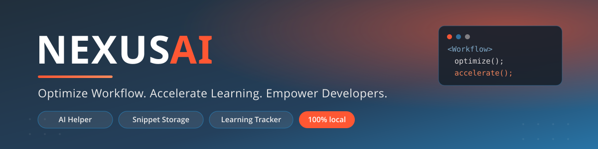
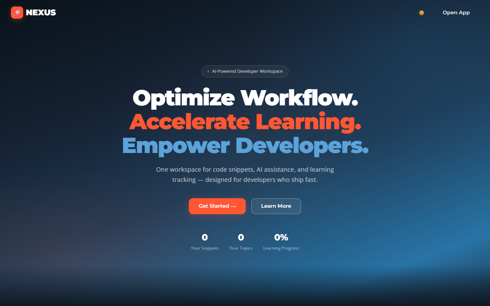
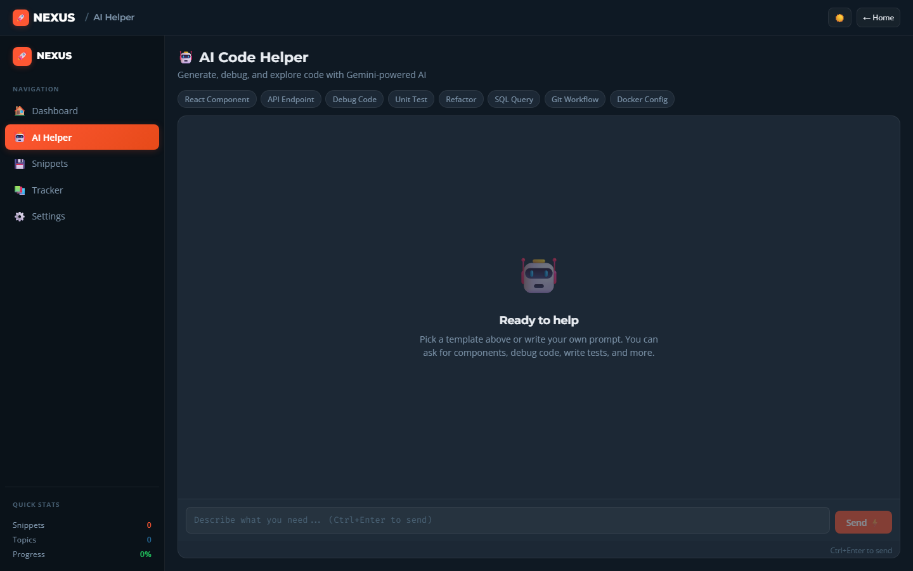
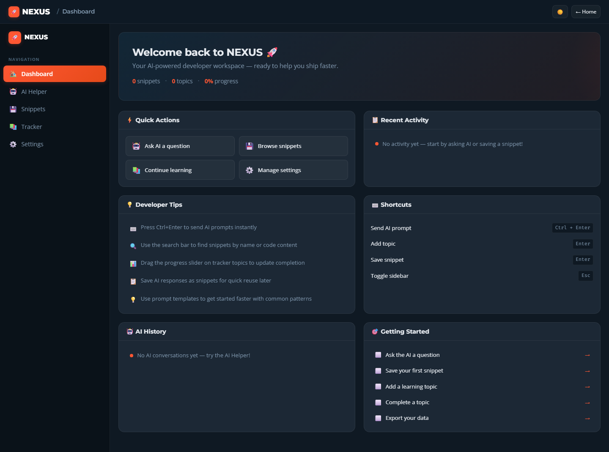
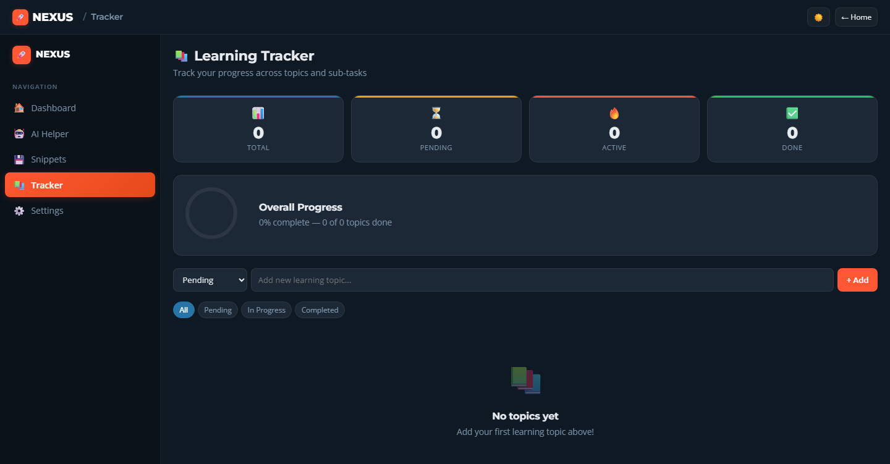
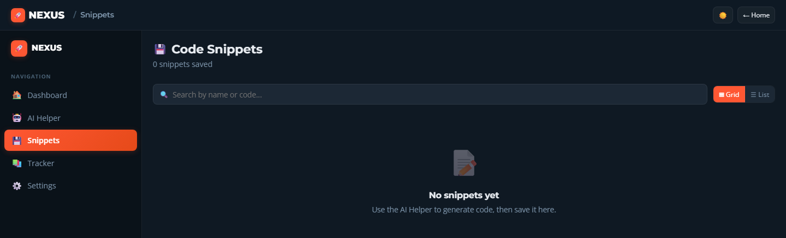
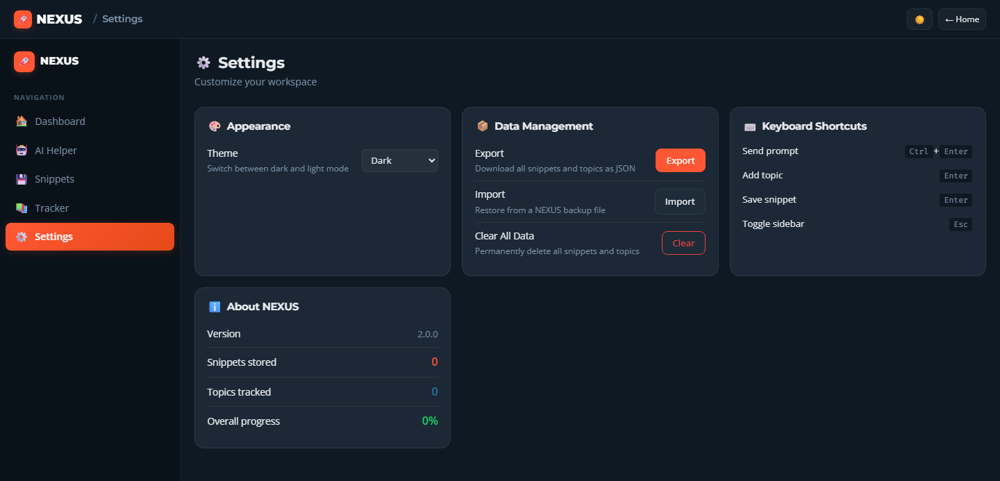
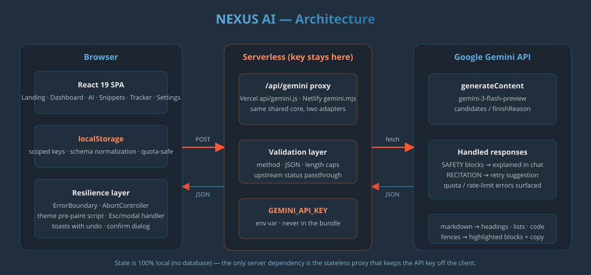

<div align="center">



# NEXUS AI

**A centralized developer workspace — an agentic AI helper, snippet manager, and learning tracker in one fast, local-first, offline-ready app.**

[](https://github.com/Dishajain280/Nexus-AI/actions/workflows/ci.yml)
[](https://ai-tool-nexus.vercel.app)


</div>

---

## ✨ What is NEXUS?

NEXUS replaces the three browser tabs every developer keeps open — an AI chat, a paste-bin of code snippets, and a notes file tracking what they're learning — with **one workspace**:

- 🤖 **Agentic AI Helper** — Gemini-powered chat that doesn't just answer, it *acts*. Give it **tool calling** (`save_snippet`, `search_snippets`, `add_topic`) and *"save this debounce function tagged utils, then show me my other JS snippets"* becomes a single prompt the app executes — with ⚙️ narration chips showing every action the AI took. Multi-turn memory means follow-ups like "now add TypeScript types to that" work; 8 one-click prompt templates; responses render as real markdown with code blocks and per-message copy / regenerate.
- 💾 **Snippet Storage with semantic search** — snippets are embedded into vectors (`gemini-embedding-001`, stored in IndexedDB) so you can search by *meaning*: "how to flatten a nested array" finds your `Flatten array` snippet even though they share no words. Tags with filter chips, grid/list views, one-click copy, an editor modal, and automatic keyword fallback when embeddings aren't available.
- 📚 **Learning Tracker** — topics with status (pending / in progress / completed), per-topic progress sliders, sub-task checklists, a progress ring, stat cards — and an **AI bridge**: any explanation the AI gives can become a tracked topic in one click.
- 🏠 **Dashboard** — quick actions, recent activity feed, a real activity streak + 5-week heatmap (computed from your actual usage timestamps), AI prompt history, and a getting-started checklist.

**Everything is stored locally in your browser** — no account, no database, no telemetry. Snippets, tracker, and chat live in namespaced `localStorage`; semantic vectors live in IndexedDB. The whole app is an **installable PWA** with a service worker, so your workspace keeps working offline (everything except live AI calls). The only server involved is a tiny stateless proxy that keeps the Gemini API key off the client (see [Security](#-security-model)).

## 📸 Screenshots

| Landing | AI Helper |
| --- | --- |
|  |  |

| Dashboard | Learning Tracker |
| --- | --- |
|  |  |

<details>
<summary>More screenshots</summary>






</details>

## 🏗️ Architecture

<div align="center">

</div>

**Request flow for an AI prompt:**

1. The React app `POST`s to the relative endpoint `/api/gemini` (with an `AbortController` so cancelled requests never update stale state), including recent chat turns as context and tool declarations.
2. A serverless function forwards it to Google's `generateContent` endpoint with the API key attached **server-side**, after validating method, JSON body, turn count, and prompt length (8,000-char cap). Tool declarations and raw `functionCall` / `functionResponse` parts pass through verbatim.
3. If Gemini requests a tool call, the app **executes it locally** (against React state + localStorage), feeds the result back as a `functionResponse`, and the model continues — up to 4 rounds per request. Final `candidates` render as markdown; `finishReason` values like `SAFETY` or `RECITATION` are explained in plain language instead of failing silently.

The same proxy core (`nexus/api/gemini-core.js`) runs on **both** Vercel and Netlify through thin, dialect-agnostic adapters (web-standard *and* classic Node request shapes), and is also mounted as Vite dev-server middleware — so dev, preview, and production behave identically. The same core serves **embeddings** (`embedContent`) for semantic search and **chat** from one validated endpoint.

## 🔒 Security model

- **The API key never reaches the browser.** The client bundle contains no key, no `VITE_*` reference — the browser only ever talks to `/api/gemini`.
- The key lives in a hosting-platform environment variable (`GEMINI_API_KEY`) or a git-ignored `.env` locally.
- All app state is namespaced under `nexus:` localStorage keys (plus a local IndexedDB store for search vectors) and never transmitted anywhere except the Gemini API calls you initiate.
- The function-calling surface is deliberately narrow: three schema-validated tools that touch only the app's own local data — no `fetch`, no filesystem, no eval.
- User input rendered as markdown is escaped to React elements — no `dangerouslySetInnerHTML` anywhere.

## 🛠️ Tech stack

| Layer | Choice | Why |
| --- | --- | --- |
| UI | React 19 + React Router 7 | Modern concurrent React, real routing with deep links |
| Build | Vite 8 | Instant HMR, tiny production bundles |
| AI (chat) | Gemini `gemini-3-flash-preview` + **function calling** | Fast code responses that can act on the workspace |
| AI (search) | Gemini `gemini-embedding-001` + cosine ranking | Semantic "search by meaning" over your own snippets (RAG-style) |
| Hosting | Vercel (primary), Netlify (supported) | Serverless functions for the proxy on both |
| Offline | Service worker + web manifest (PWA) | Installable, network-first shell with offline fallback |
| Styling | Hand-written CSS design system | Charcoal / Royal Blue / Fiery Orange palette, light + dark themes, no framework overhead |
| Storage | `localStorage` (structured) + IndexedDB (vectors) + schema normalization | Zero-backend persistence that survives schema changes |

## 🚀 Run it locally

```bash
git clone https://github.com/Dishajain280/Nexus-AI.git
cd Nexus-AI
npm install
npm run dev        # → http://localhost:5173
```

| Script | What it does |
| --- | --- |
| `npm run dev` | Vite dev server (the `/api/gemini` proxy runs as dev middleware) |
| `npm run build` | Production build to `dist/` |
| `npm run preview` | Serve the production build |
| `npm run lint` | ESLint |
| `npm run test:run` | Vitest unit tests (storage normalization, share links, markdown parsing, proxy core) |

**API key (optional locally):** create `nexus/.env` (git-ignored) with `GEMINI_API_KEY=<your key>` from [Google AI Studio](https://aistudio.google.com/apikey). Without it, everything except AI generation and semantic search works, and the app explains exactly what's missing. Free-tier note: the preview model allows ~20 requests/minute — the chat surfaces Google's retry countdown rather than hiding it.

## ☁️ Deployment

Deployments are preconfigured for both platforms — see the full details in [`netlify.toml`](netlify.toml), [`vercel.json`](vercel.json), and [`nexus/vercel.json`](nexus/vercel.json):

- **Vercel:** root `vercel.json` builds the app (`npm run build` → `dist/`), routes `/api/gemini` to the serverless function in `api/`, and rewrites everything else to `index.html` for SPA deep links.
- **Netlify:** `netlify.toml` does the same via the function in `nexus/api/gemini.mjs`.
- Either way: set `GEMINI_API_KEY` in the platform's environment-variable settings.

## 🧭 Roadmap

- [x] Multi-turn AI context — follow-up questions work across turns
- [x] Snippet tags + tag filtering
- [x] Agentic tool calling — the AI saves snippets, searches the library, and adds topics
- [x] Semantic snippet search (embeddings + IndexedDB + cosine ranking)
- [x] Installable offline PWA
- [x] Unit tests (Vitest) + CI pipeline — lint + tests + build on every push (see `.github/workflows/ci.yml`)
- [ ] Streaming responses (token-by-token) with stop / regenerate
- [ ] Chat with snippets — include retrieved snippet code in the AI's context
- [ ] Cloud sync (opt-in) with accounts — local-first stays the default

## 🎓 What I learned

- **Serverless proxies are the right shape for API keys.** The first version shipped the key in a `VITE_*` variable — visible to anyone who opened DevTools. Moving to a stateless serverless function (with validation and error passthrough) fixed it, and making the same core run on Vercel, Netlify, *and* the Vite dev server taught me a lot about adapter design — including why an adapter should accept *both* web-standard and classic Node request shapes instead of guessing one.
- **Agentic loops are simpler than they sound.** A useful tool-using agent turned out to be: tool schemas on the request → execute the `functionCall` locally → return a `functionResponse` → repeat, capped. The hard part isn't the loop; it's designing tools narrow enough that the model can't do damage.
- **Model deprecation is a runtime problem, not a footnote.** The embedding model I built on (`text-embedding-004`) was retired mid-development and started returning 404s — so semantic search now probes for model errors, falls back to keyword ranking, and the model name is a single config constant. `batchEmbedContent` also doesn't exist on `v1beta` for the current model, which taught me to read API reference tables *per version*.
- **Git submodules bite when you don't know they exist.** This repo once deployed an empty `nexus/` folder because the app directory was accidentally committed as an embedded-repo gitlink — the internet's least-helpful error (`Cannot resolve entry module index.html`) turned into a deep dive into git tree entries, `git archive`, and CI-from-first-principles debugging.
- **Persistence needs a schema.** localStorage "works" until a saved topic from an older version has no `progress` field and the progress bar renders `width: undefined%`. A normalization/migration layer on load made the app tolerant of its own history.
- **Hand-rolling a markdown renderer** (headings, lists, code fences, inline formatting, XSS-safe output as React elements) taught me more about parsing than dropping in a library would have.
- **Honest products are better products.** Early versions had invented stats ("10K+ developers!") on the landing page. Replacing them with the app's real, live numbers made the project more credible — and made me think about what the app can actually prove.

## 📄 License

Released under the [MIT License](LICENSE).

---

<div align="center">
<sub>Built with ⚡ by <a href="https://github.com/Dishajain280">Dishajain280</a> · Charcoal <code>#212F3C</code> · Royal Blue <code>#2874A6</code> · Fiery Orange <code>#FF5733</code></sub>
</div>
